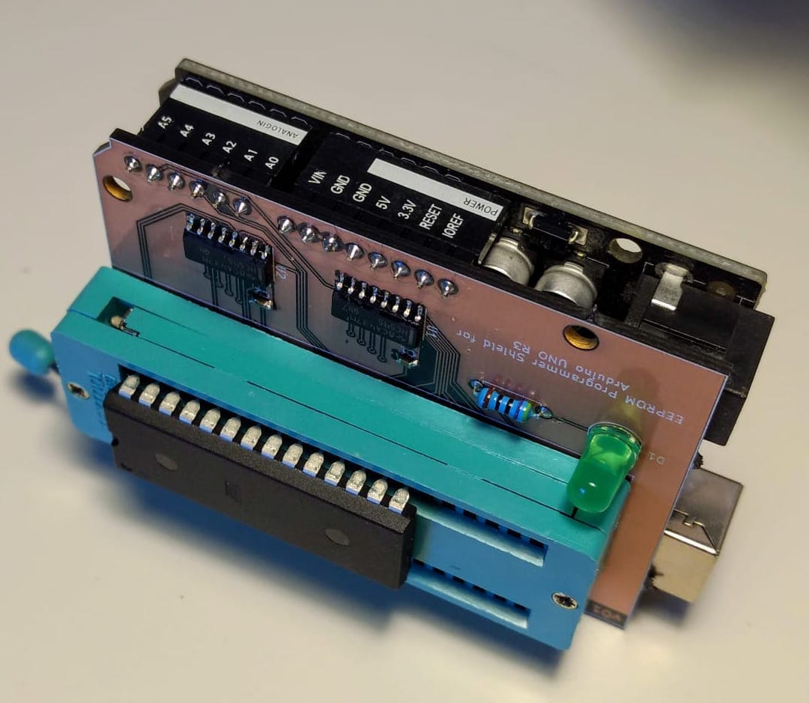

## EEPROM Programmer

I had a number of projects in mind that I wanted to do without the use of a
microcontroller. Yet, I needed some sort of persistent data storage
that was easy to access on a breadboard with just basic logic components.

I decided to try and use old EEPROMs for this. In contrast to most newer
EEPROMs they have parallel input and output pins for address and data making
it trivial to read from.

However, since parallel I/O requires lots of pins,
these chips tend to be much larger and expensive than their modern serial
counterparts that have largely replaced them.

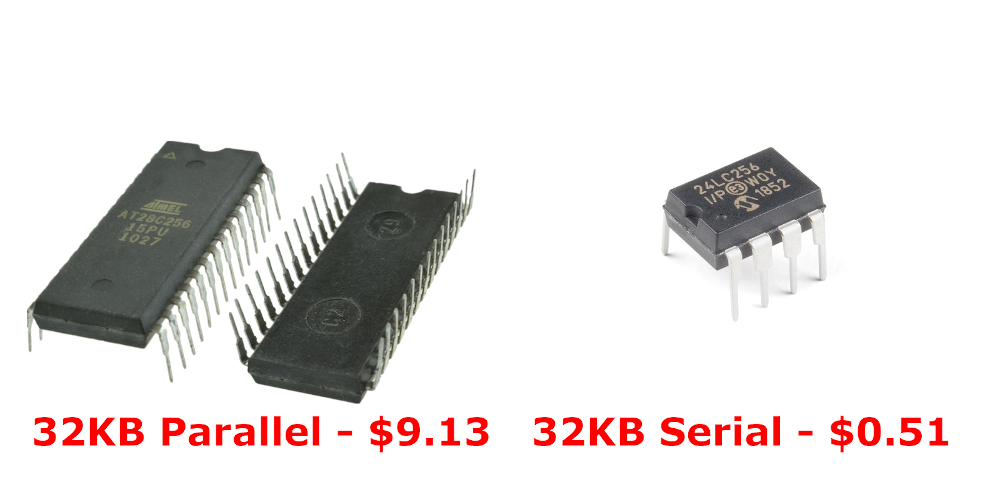


## Atmel AT28C256

I chose to target the [Atmel AT28C256](https://www.microchip.com/wwwproducts/en/AT28C256)
as it's still actively produced. It has
15 address pins for 2^15 = 32768 addresses. Each address points to one byte,
the content of which appears on the 8 I/O pins for a total capacity of 32768
bytes, or 256 [Kibibit](https://en.wikipedia.org/wiki/Kibibit).


## Programming

To load data you need an EEPROM programmer and like the chips, these have
become somewhat rare and expensive. Hence the project to build one ourselves.

The easiest approach is probably to use a microcontroller to bridge between
the chip and a computer, run a bidirectional serial protocol between the
microcontoller and the computer to send image data back and forth.

Since the AT28C256 requires 5v for writing, we can't use a Raspberry Pi or
Arduino Nano/Mini as their GPIO ports are all 3.3v. The regular old
[Arduino UNO](https://store.arduino.cc/usa/arduino-uno-rev3) is 5v though and
so should work nicely.


## Schematic

Since the Arduino UNO does not have enough GPIO pins, we cannot hook up all
address and I/O pins directly. Instead, we'll use two daisy-chained 8 bit
[595 shift registers](https://assets.nexperia.com/documents/data-sheet/74HC_HCT595.pdf)
to stage the 15 bit address so that we have to use only 1 pin on the
Arduino instead of 15. That leaves enough pins for the I/O lines, shift
register control lines and an activity LED.

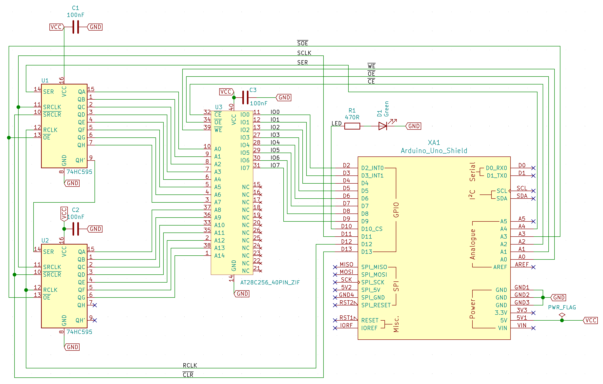


## Reading

To read data is just a matter of putting a 15 bit address on the address pins
and then reading the byte that appears on the I/O pins. To do this, we write
the address out to pin `A4` one bit at a time. Pin `A4` is connected to the first
shift register's data line (`SER` in the schematic).

After each bit, a pulse is sent out on pin `D11` which is connected to the shift
registers' clock inputs (`SRCLK` in the schematic). At each pulse, the bit on
the data line is stored in the first of 8 latches, while the existing data is
shifted one position down. The value of the last latch is shifted to pin `QH'`
which serves as the data input for the second shift register.

When all 15 bits have been shifted in, a pulse on line `D12` triggers the
registers' storage clock (`RCLK`) and makes the contents of the latches appear
on the output pins `QA-QH` which are connected to the EEPROM's address pins.

Within 150ns the contents of the address then appears on the EEPROM's output
pins where we can read it on the `D2-D9` pins of the Arduino. 


## Writing

Writing data is a bit more work.

First, we shift out the address we want to write as before. Then we bring the
EEPROM's Output Enable (`~OE`) high and Chip Enable (`~CE`) low to put the I/O
pins in high impedance mode.

Then we output the data we want to write onto the `D2-D9` I/O lines, followed
by a high-low-high pulse on the EEPROM's `~WE` pin (connected to `A0` on the
Arduino). This initiates a write operation which needs up to 10 milliseconds to
complete.

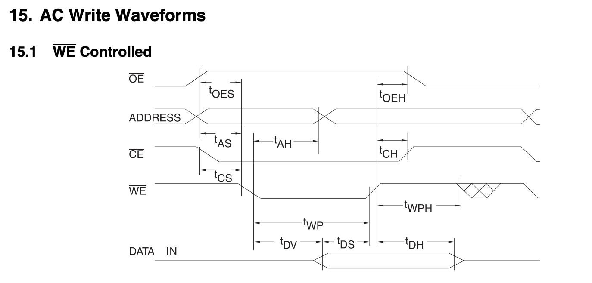

At 150ns vs 10ms for reading and writing respectively, the difference in
performance is tremendous. To address this, the chip has a Page Write mechanism
that allows for bursts of up to 64 bytes to be written in one cycle, using a
64 byte internal page memory staging area and a slightly more involved write
sequence.

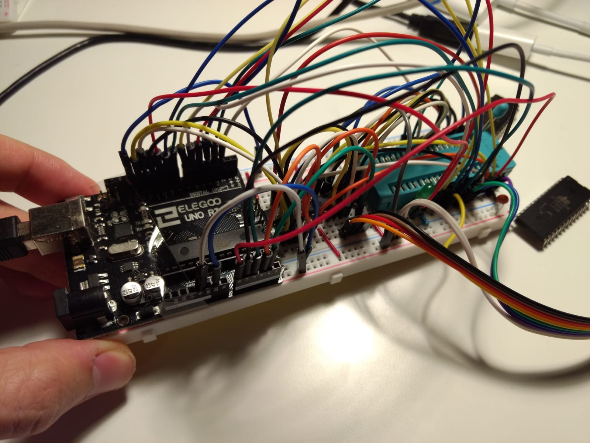


## Arduino Code and Python Interface

To communicate with the Arduino interactively, we defined a simple
bidirectional, command-based protocol for use over the serial-to-USB interface.

On the computer we run a Python script that sends commands to the Arduino which
responds by either reading or writing data.

The protocol has 5 distinct commands:

* **read**: tells the Arduino to read a single address and return its value
* **write**: tells the Arduino to write a given byte to a specific address
* **dump**: dumps the entire contents of the EEPROM as a binary stream
* **load**: writes a stream of binary data to the EEPROM
* **reset**: resets the interal state of the Arduino to recover from errors

The Python client program implements this protocol and have data piped directly
to it on the shell.

```text
$ ./eeprom.py --help
usage: ./eeprom.py [-h] [-p PORT] {dump,load,test} ...

AT28C256 EEPROM Programmer

positional arguments:
  {dump,load,test}      sub-command help
    dump                dumps the entire contents of the EEPOM to stdout
    load                loads up to 32kb of stdin onto the EEPROM
    test                writes random data and reads it back for verification

optional arguments:
  -h, --help            show this help message and exit
  -p PORT, --port PORT  the serial port the Arduino is connected to (on OSX
                        typically /dev/tty.usbmodemXXXX)
$
```

It also has an interactive REPL-like interface that can be handy to peek and
poke at specific addresses.

```text
$ ./eeprom.py 
AT28C256 EEPROM Programmer

Read or write individual addresses, dump out the full contents to a file, or
load an image file onto the EEPROM.

To read a single byte:
> [r|read] [addr]

To write a byte to a specific address:
> [w|write] [addr] [value]

To dump the entire EEPROM to a file:
> [d|dump] [filename]

To load a local file into the EEPROM:
> [l|load] [filename]

Send a reset command:
> reset

Address supports hex (0xFF) and octal (0o7) notation.

>
```

## Amazon

As parallel EEPROMs are somewhat expensive, I thought it would be a good idea
to order from a
[Chinese seller](https://www.amazon.com/sp?_encoding=UTF8&seller=A16AIX8W4ITW1M)
claiming to have genuine, brand new Atmel AT28C256 chips for a fifth of US
retail price. Even if one were defective, I'd still have 4 left.

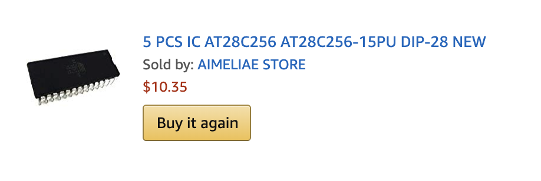

Don't.

All 5 chips already contained data (new chips come empty as per the datasheet).
Two of them had the software write protection enabled (new chips never have
that as your first action will be to write to them). Two others exhibited
corruption issues where specific addresses would fail to hold their data.

Still, the seller maintained the product was brand new and not at all pulled
from old computer equipment.

```text
$ file eeprom2.bin 
eeprom2.bin: PDP-11 demand-paged pure executable
```


## PCB

With the breadboard circuit, Arduino code and Python CLI interface working I
decided to try and create a custom PCB in [KiCad](http://www.kicad-pcb.org/)
that would slot onto the Arduino as a
[Shield](https://learn.sparkfun.com/tutorials/arduino-shields/all) extension
board.

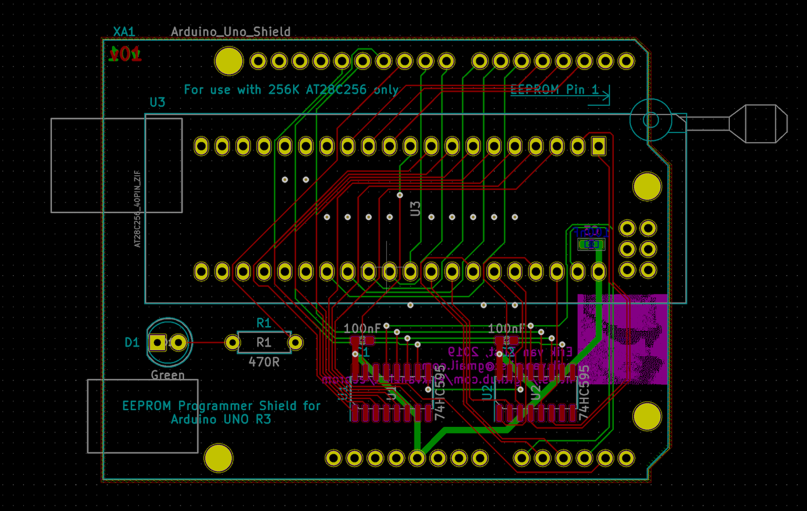

To gain some experience hand-soldering surface mount devices, I picked SMT
packages for the shift registers and decoupling capacitors.

The ZIF socket is a 40 pin device I had lying around. Since the AT28C256 is a
28-DIP, I just left the 12 left-most pins unconnected. It's a low budget
project.

When I went to upload the Gerber files to [OshPark](https://oshpark.com) for
fabrication I noticed their "[After Dark](https://docs.oshpark.com/services/afterdark/)"
option that uses a black FR4 substrate,
with transparent soldermask that makes the copper traces pop against a black
background.

Unfortunately I made this choice after I already designed and
uploaded the board and failed to realize I should have removed the ground plate
from the front of the board for the visual effect to work.

<blockquote class="twitter-tweet">
<p lang="en" dir="ltr">Beginner&#39;s mistake on my part.<br><br>
If you&#39;re gonna go for maximum &quot;After Dark&quot; effect (and you 
should, cause it&#39;s awesome), don&#39;t do a ground pour.
<a href="https://twitter.com/oshpark?ref_src=twsrc%5Etfw">@oshpark</a> 
<a href="https://twitter.com/hashtag/AfterDark?src=hash&amp;ref_src=twsrc%5Etfw">#AfterDark</a>
<a href="https://t.co/L0HSFzPOCa">pic.twitter.com/L0HSFzPOCa</a>
</p>&mdash; Erik van Zijst (@erikvanzijst)
<a href="https://twitter.com/erikvanzijst/status/1177700165064376320?ref_src=twsrc%5Etfw">September 27, 2019</a>
</blockquote>
<script async src="https://platform.twitter.com/widgets.js" charset="utf-8"></script>

The board still works fine either way and provided good SMT practice although
next time I could change the footprints to have longer exposed pads.

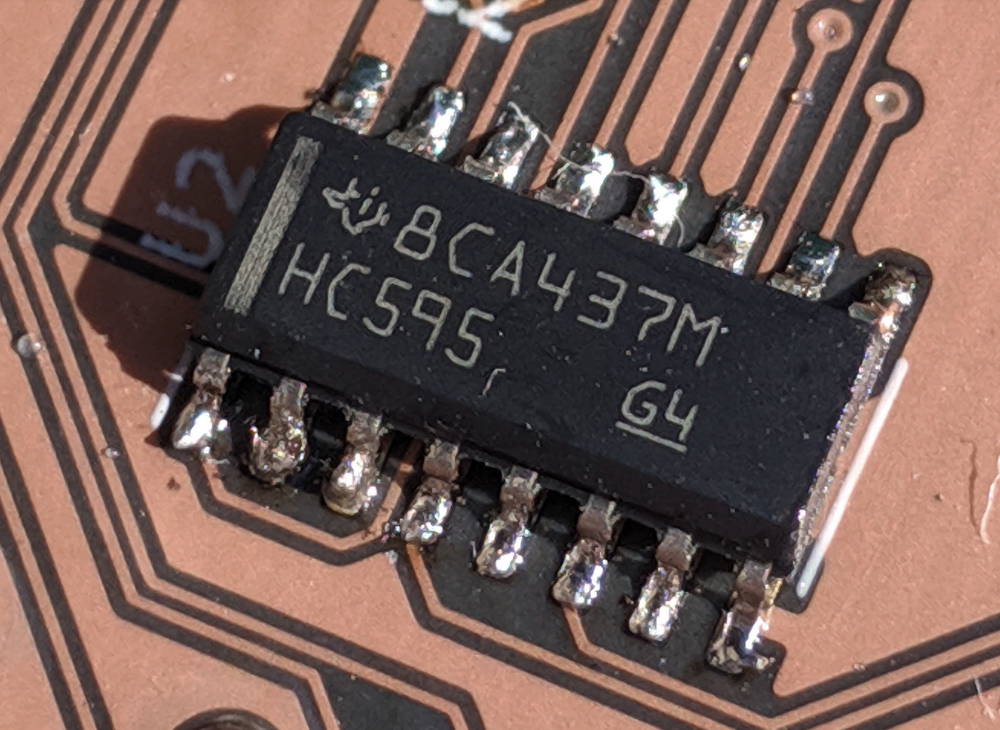

## Final Board and Resources

The KiCad project as well as the serial protocol description and code for the
Arduino and Python CLI can be found on
[here on GitHub](https://github.com/erikvanzijst/eeprom).

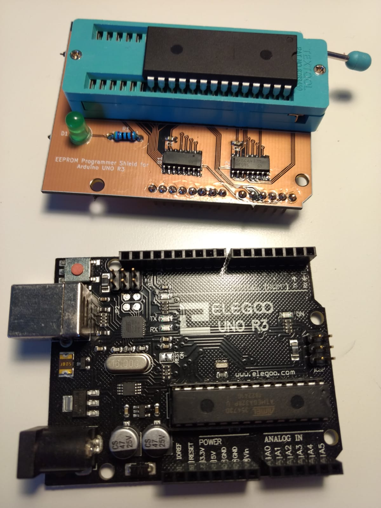
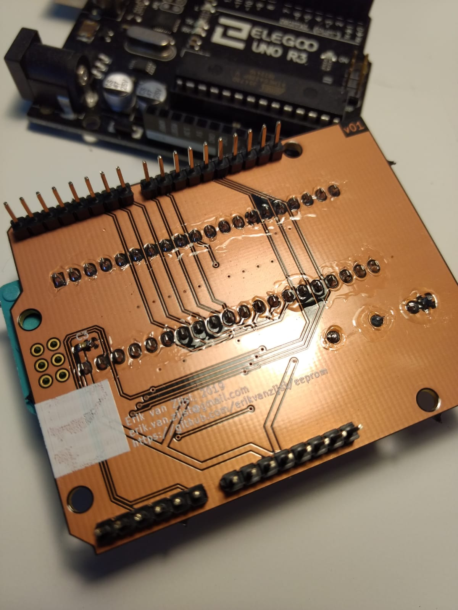
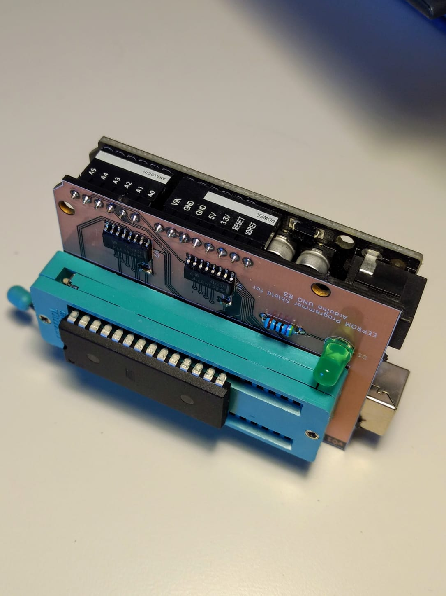
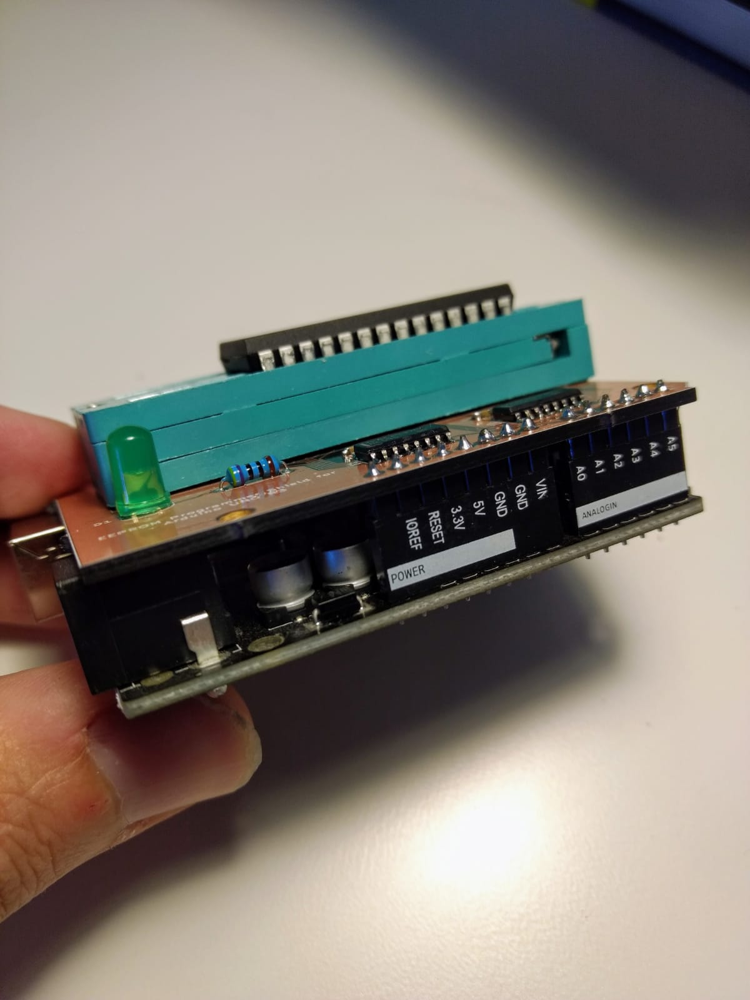

<iframe width="560" height="315" src="https://www.youtube.com/embed/HwUqPn2EaRc" frameborder="0" allow="accelerometer; autoplay; encrypted-media; gyroscope; picture-in-picture" allowfullscreen></iframe>
