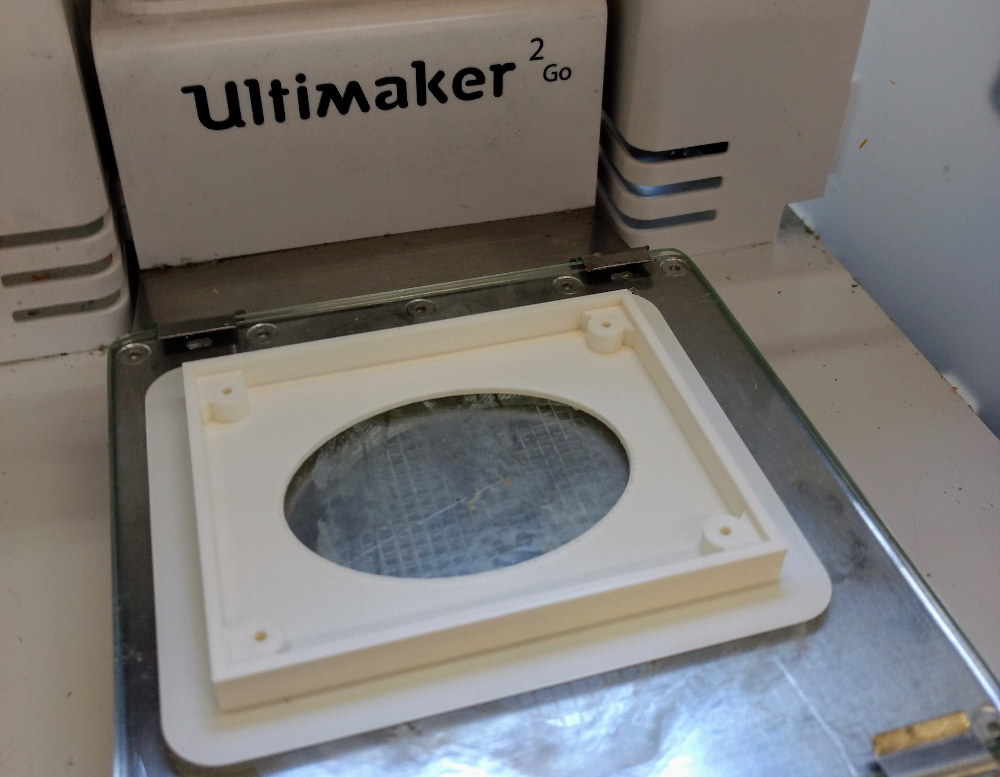
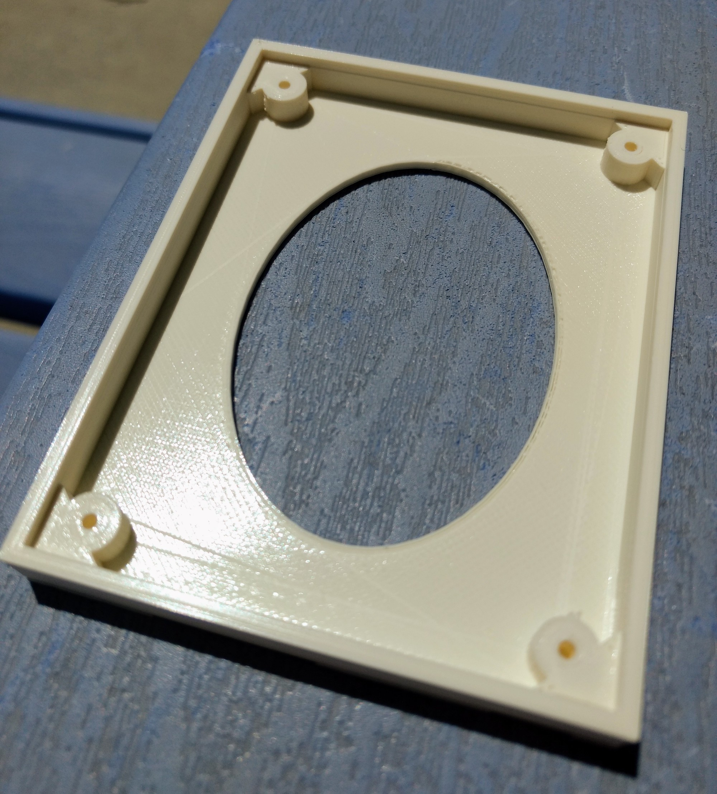
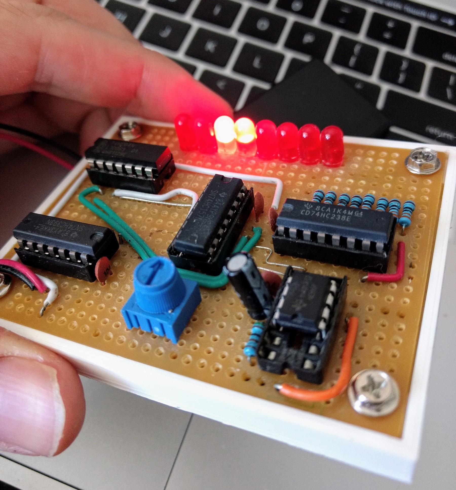
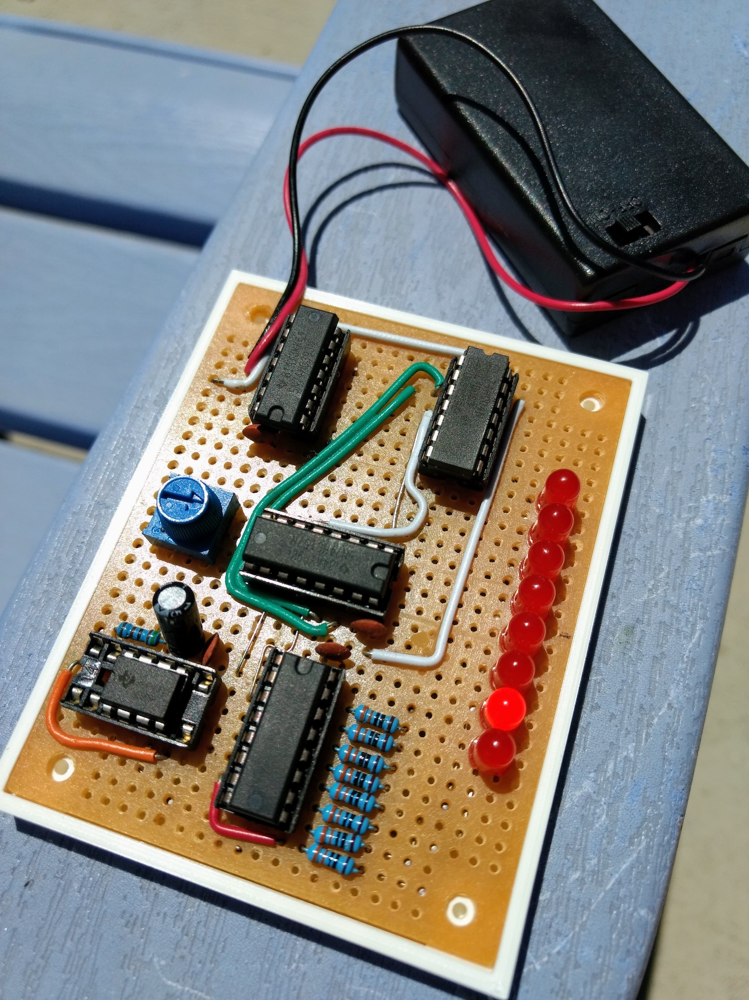

Knight Rider LEDs Part 2 (Protoboard)
-------------------------------------

<iframe width="560" height="315" src="https://www.youtube.com/embed/X1pnx1YPB2o" frameborder="0" allow="accelerometer; autoplay; encrypted-media; gyroscope; picture-in-picture" allowfullscreen></iframe>

The soldered-up version of the breadboard from the [previous project](knightrider1).

I also created a 3D printed [mounting plate in Tinkercad](https://www.tinkercad.com/things/81D3xJhzd30-knight-rider-protoboard-base) for the breadboard to provide some
protection for the solder connections.

And the final result:

