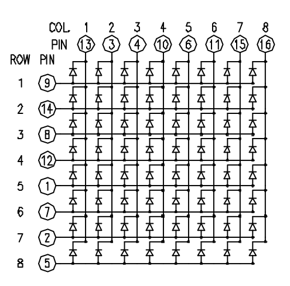
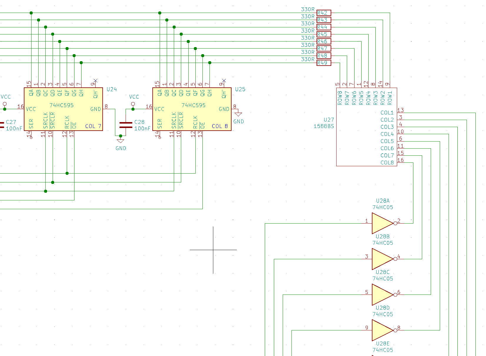
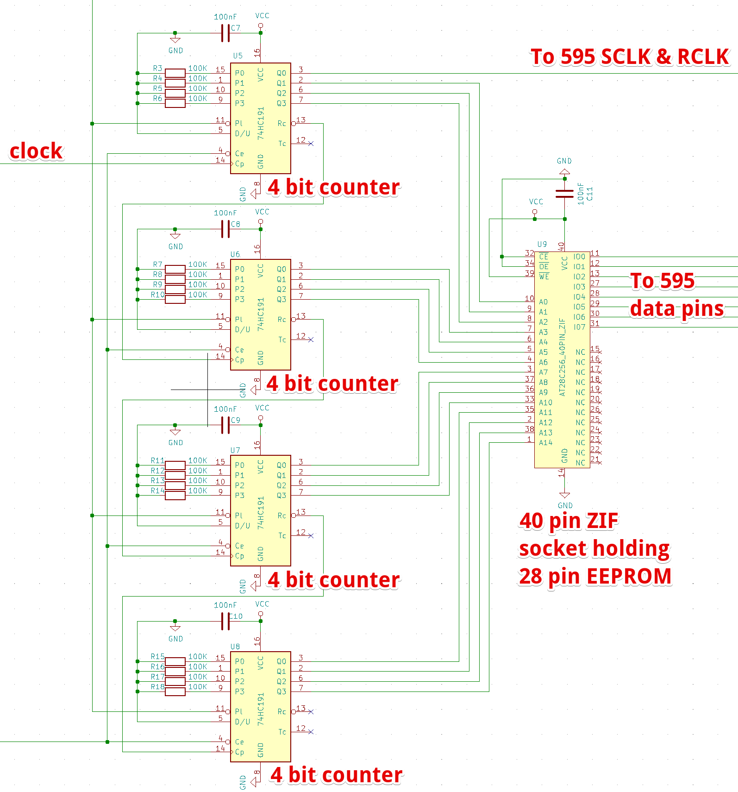
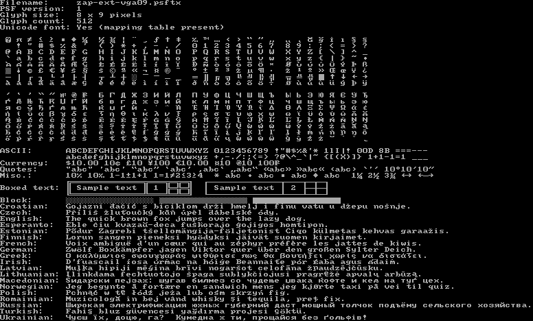

## Matrix Displays

I was interested in using an LED matrix display and I picked up some cheap 8x8
ones on Amazon.

Matrix displays typically don't have individual pins for each LED. Instead,
internally the LEDs are connected in a grid pattern, exposing only the row and
column terminals. Either the row pins are all anode and the column pins cathode,
or vice versa.

Put power on row 3 and connect column 2 to ground and the LED on the
intersection between those lines lights up.

You can uniquely address only one entire row or column at a time and so to
display a steady image covering the entire display, you need to quickly
scan over the rows/columns, refreshing them faster than the eye can see.

My Amazon order came in a ziplock bag without datasheet or product numbers and
since the position of the pins does not at all line up with the rows and
columns, it took a while figuring things out.

## Driving Matrix Displays

A common way to drive bare matrix displays of this kind is to hook them up to
a microcontroller and implement the continuous refresh cycle in software,
painting one column at a time at high speed, typically using a
[shift register](https://en.wikipedia.org/wiki/Shift_register)
as a staging area holding the pixels for the active column.

In case of a [74xx595](https://www.arduino.cc/en/tutorial/ShiftOut), the shift
register's 8 outputs are connected the 8 row
pins, providing the anode for the LEDs. The column pins can be connected to the
MCU directly as output pins. Put 8 bits in the shift register and pull one of
the column pins low so as to be current sink and one row will light up. Now
load the data for the next row and toggle the next column. Rinse and repeat
many times per second.

To offload the MCU, there are [specialized ICs](https://playground.arduino.cc/Main/LEDMatrix/)
implementing the refresh logic in hardware.

I did not want to use a microcontroller or code, but instead try to drive the
displays directly with basic logic hardware.

## Marquee

A relatively simple application is the scrolling marquee. For this I used 8
74HC595 shift registers, each dedicated to holding the data for one column. All
registers are connected to a single bus. Only one register has its output pins
enabled at any one time, with the others set to tri-state.

The 8 cathodes of the displays are connected to 8 [74HC05](https://assets.nexperia.com/documents/data-sheet/74HC05.pdf)
open-drain inverters acting as sinks.

The control logic responsible for cycling through the shift registers and
drains is implemented using a [555 timer chip](http://www.ti.com/lit/gpn/ne555)
oscillating at ~400Hz, driving a [4 bit binary counter](https://assets.nexperia.com/documents/data-sheet/74HC_HCT393.pdf)
of which we only use the lower 3 bits to repeatedly count from 0-7.  

The binary counter then feeds to 3-8 line decoders that activate one shift
register and column sink at a time.

A line decoder activates the output pin that corresponds to the binary number
on its inputs. A 3 line decoder therefore has 8 output pins. The binary number
3 (011) triggers line Y3 of the decoder to go high, which opens the inverter for
the 4th column (zero, binary 000, activates line Y0 and 7, binary 111,
activates Y7).

Since the 595 Output Enable inputs are "active low", we need a line decoder
with inverted outputs (all pins high, except the active one). This is why we
use both a [74HC138](https://assets.nexperia.com/documents/data-sheet/74HC_HCT138.pdf)
and its nearly identical cousin [74HC238](https://assets.nexperia.com/documents/data-sheet/74HC_HCT238.pdf)
for the row and columns respectively.

## Clocking input

With this in place all we have left to do is feed the shift registers with
data. If we do this continuously, we'll get a scrolling marquee.

As we're not using a microcontroller, I chose to use a parallel
[EEPROM](https://en.wikipedia.org/wiki/EEPROM) for data
storage. EEPROMs act like non-volatile [SRAM](https://en.wikipedia.org/wiki/Static_random-access_memory)
and the older, parallel ones have
a parallel address and data bus that makes them trivial to interface with.

The parallel address bus limits the capacity. You need a large physical chip
with 15 address pins and 8 data pins for just 32KiB of data. As this doesn't
scale well, more modern EEPROMs have
[serial interface protocols](https://www.rfwireless-world.com/Terminology/UART-vs-SPI-vs-I2C.html).

We hook up the address pins to a 15 stage ripple counter that slowly cycles
through the entire address space and we hook up the 8 data pins to the data
input lines of the shift registers. After loading an address and putting the
8-bit data onto the shift register's inputs, we clock the shift and latch pins
of all registers simultaneously, appending a new row of data to the display.

Because there are no 15 stage ripple counters, we're daisy chaining 4 4-stage
[74HC191](https://assets.nexperia.com/documents/data-sheet/74HC191.pdf)
counters. We're using the 15 high bits for the EEPROM address and the first bit
(LSB) as a clock signal write the input to the shift registers between the
loading of the addresses.

The clock signal is produced by another 555 timer running at 48Hz.

<iframe width="650" height="700" src="https://www.youtube.com/embed/7vDrLuH4eWA" frameborder="0" allow="accelerometer; autoplay; encrypted-media; gyroscope; picture-in-picture" allowfullscreen></iframe>

###N.B.

The font used in the video is the standard 8x9 (truncated to 8x8) [Linux
console font](https://www.zap.org.au/software/fonts/console-fonts-zap/)
for VGA text displays.

I wrote [2 small scripts](https://gist.github.com/erikvanzijst/50b74403c8a2465201c41968dd26081b)
to load the text output from [psftools](https://www.seasip.info/Unix/PSF/) and
compile any string to the binary format expected by the circuit.