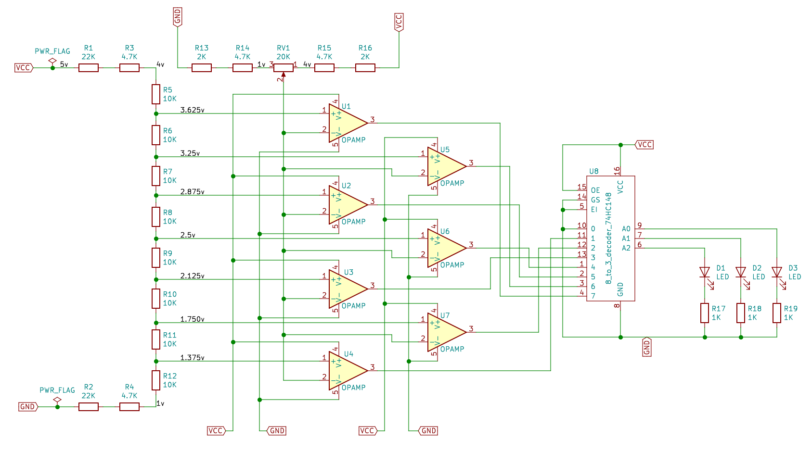

3 Bit Digital to Analog Converter
---------------------------------

<iframe width="560" height="315" src="https://www.youtube.com/embed/z3wcODP0M10" frameborder="0" allow="accelerometer; autoplay; encrypted-media; gyroscope; picture-in-picture" allowfullscreen></iframe>

An exercise in turning the analog input from a potentiometer into digital form.

Instead of using a specialized, off the shelf ADC, this circuit uses
operational amplifiers in open-loop to compare the voltage over the pot's wiper
to 7 pre-configured voltage levels produced by a resistor ladder.

If the pot's voltage exceeds an op amp's reference voltage, its output goes
low. The output of these 7 op amps is then fed to an 8-to-3 priority line
decoder that looks for the highest line with an active signal and turns that
into a 3-bit binary number on its outputs.

The decoder used is the SN74HC148 which has inverted inputs and outputs,
meaning that a low voltage is considered active and a high voltage inactive.
Therefore, if input line 7 (MSB) is low, it represents the highest number and
the binary value 7 is output (which is also inverted and so represented as
"000").

When the pot is turned all the way down and its voltage falls below that of the
reference voltage of the 7th opamp (1.375v), all the opamps are active (a high
voltage on their outputs), which is interpreted as inactive by the inverting
line decoder.
   
Note that the lowest input line of the decoder is tied to ground so that we
never have all input lines high. The line decoder translates 01111111 as zero
(111 binary output), 10111111 as 1 (110 binary output), and 00000001 as 7
(000 binary output).

Note that the resistor ladders are configured such that the variable domain is
limited to the 1-4v range (so the pot starts at 1v and swings up to 4v), instead of
the full 0-5v. This is because the LM324AN op amp does not offer rail-to-rail
performance. So instead of feeding the op amps with a higher voltage power
source, we instead shape the input values.

Components used:

* 2x LM324AN Quad Operational Amplifier -- [http://www.ti.com/lit/ds/symlink/lm224.pdf](http://www.ti.com/lit/ds/symlink/lm224.pdf)
* 1x SN74HC148 8-to-3 Line Priority Encoder -- [http://www.ti.com/lit/ds/symlink/sn74hc148.pdf](http://www.ti.com/lit/ds/symlink/sn74hc148.pdf)
* Loads of resistors