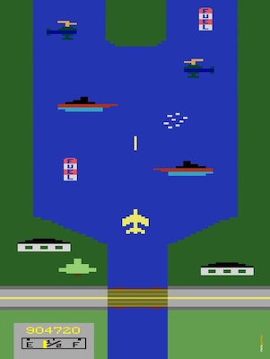
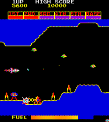
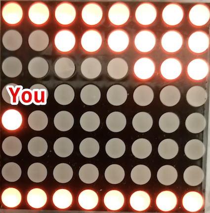
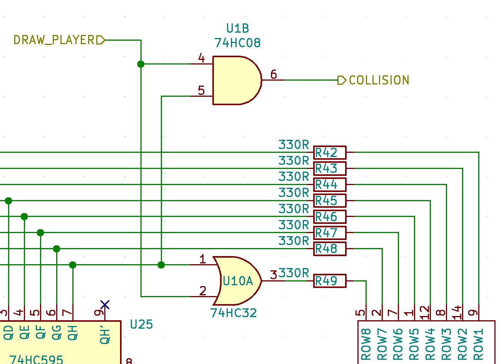

## Scramble: A Simple Scrolling Game

With the [marquee display working](../matrix/matrix.md), I figured it would be
interesting to see if it could be expanded upon with some interactive elements
to turn it into a (very simple!) game.

Could we fly and navigate a pixel through a scrolling field of obstacles in the
style of early games video?

I loved playing [River Raid](https://www.youtube.com/watch?v=pmPjsBDN9Xw) in
the mid 80s which according to [creator Carol
Shaw was inspired](http://www.vintagecomputing.com/index.php/archives/800) by
the 1981 Konami video game
[Scramble](https://en.wikipedia.org/wiki/Scramble_%28video_game%29).

With a heavy dose of imagination, a 8x8 two-color display with a single
interactive pixel for a spaceship might be a bit like the horizontally
scrolling game Scramble?

## No Microcontroller

When tinkering with the [marquee circuit](../matrix/matrix.md), I decided to
avoid using a microcontroller, Arduino or Raspberry Pi and code, but instead
hardwire everything using basic logic ICs. Even though it severely limits the
complexity we can reasonably achieve on a breadboard, it'd be a fun challenge
to continue this artificial restriction.

## Overlay Drawing 

Since the marquee circuit merely displays what's in the shift registers and
can only append to the data, not modify any pixel data already in the latches,
I decided to draw the movable pixel on top of the marquee data, on the
left-most column of the display and let you move it up an down using some
input control.

Your pixel will be at any value between 0-7 on the left-most column and to
paint it on the display, we need to wait until the row that we are on is being
drawn and then light up the last (left) pixel of the row, regardless of the
contents of the shift register at that location. When a row is painted that we
are not on, then the last pixel should just reflect the contents of the
register.

Expanding on the schematic from the [marquee circuit](../matrix/matrix.md), we
can use an OR gate to compare the value of the last bit of the shift
register and whether our pixel is located on the row currently being painted.

This also provides a convenient place for collision detection and the player to
die. If both lines are high, we have a collision, so at this point we're adding
a [74HC08](https://assets.nexperia.com/documents/data-sheet/74HC_HCT08.pdf)
(quad AND gate) and
[74HC32](https://assets.nexperia.com/documents/data-sheet/74HC_HCT32.pdf)
(quad OR gate).